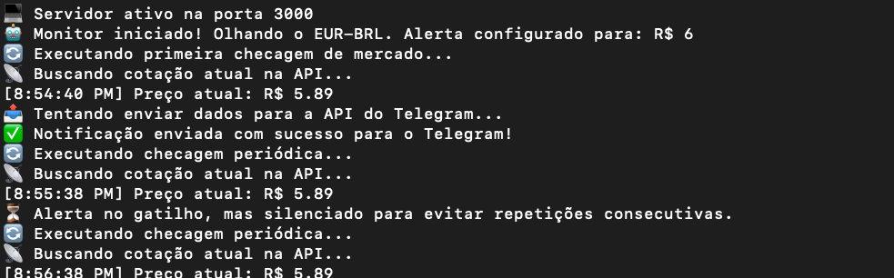

📈 Monitor de Câmbio de Moeda (EUR-BRL) com Alerta no Telegram

Este é um projeto em Node.js que monitoriza em tempo real a cotação do Euro (EUR) em relação ao Real Brasileiro (BRL). O sistema faz verificações periódicas através de uma API financeira e envia notificações automáticas para o Telegram sempre que a cotação atingir o limite configurado.

---

🚀 Funcionalidades

* **Monitorização em Tempo Real:** Consulta a cotação atual do EUR-BRL de forma automatizada.
* **Alertas Inteligentes:** Notifica o utilizador via Telegram quando a moeda atinge o valor programado.
* **Prevenção de Spam:** Sistema de silenciamento temporário para evitar o envio de mensagens repetitivas consecutivas.
* **Pronto para Produção:** Configurado para rodar localmente ou em plataformas de alojamento como o **Render**.

---

🛠️ Tecnologias Utilizadas

* **Runtime:** [Node.js](https://nodejs.org/)
* **Framework Web:** [Express](https://expressjs.com/)
* **Gestão de Variáveis:** [Dotenv](https://www.npmjs.com/package/dotenv)
* **Comunicação:** API de Bots do Telegram

---

💻 Como Rodar o Projeto Localmente

1. Pré-requisitos
Certifica-te de que tens o **Node.js** instalado na tua máquina.

2. Clonar o Repositório
```bash
git clone [https://github.com/fabioramos/monitor-moeda.git](https://github.com/fabioramos/monitor-moeda.git)
cd monitor-moeda

3. Instalar as Dependências
npm install

4. Configurar as Variáveis de Ambiente
Cria um ficheiro .env na raiz do projeto (este ficheiro está configurado no .gitignore e nunca será exposto publicamente) e adiciona as seguintes chaves:
TOKEN_TELEGRAM=o_teu_token_do_bot_aqui
ID_TELEGRAM=o_teu_chat_id_aqui
PORT=3000

5. Iniciar o Servidor
npm start

O terminal deverá mostrar que o servidor está ativo e a primeira checagem de mercado foi executada com sucesso!

☁️ Deploy (Alojamento no Render)
Este projeto está preparado para ser alojado no Render (ou serviços semelhantes):

Cria um novo Web Service no Render e conecta-o ao teu repositório do GitHub.

No painel do Render, define o Start Command como npm start.

Na secção Environment Variables, adiciona as chaves TOKEN_TELEGRAM e ID_TELEGRAM com os teus dados reais.

📝 Licença
Este projeto está sob a licença MIT. Sente-te livre para usar, modificar e distribuir.

Desenvolvido por Fábio Ramos 😎

